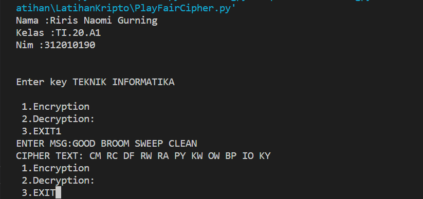
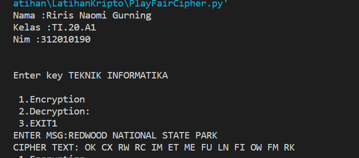

# LatihanKripto

<strong>Repository ini dibuat untuk memenuhi tugas Kriptografi</strong>
| <strong>Nama</strong> | <strong>Riris Naomi Gurning</strong> |
| ----------- | ----------- |
| <strong>NIM</strong> | <strong>312010190</strong> |
| <strong>Kelas</strong> | <strong>TI.20.A.1</strong> |

# Enkripsi Playfair Chiper pada Plaintext:

1. Dengan kata kunci "TEKNIK INFORMATIKA"
Dengan kata pesannya "GOOD BROOM SWEEP CLEAN"

Ini hasil dari kode tersebut

2. Dengan kata kunci "TEKNIK INFORMATIKA"
Dengan kata pesannya "REDWOOD NATIONAL STATE PARK"

Ini hasil dari kode tersebut

2. Dengan kata kunci "TEKNIK INFORMATIKA"
Dengan kata pesannya "REDWOOD NATIONAL STATE PARK"

Ini hasil dari kode tersebut

